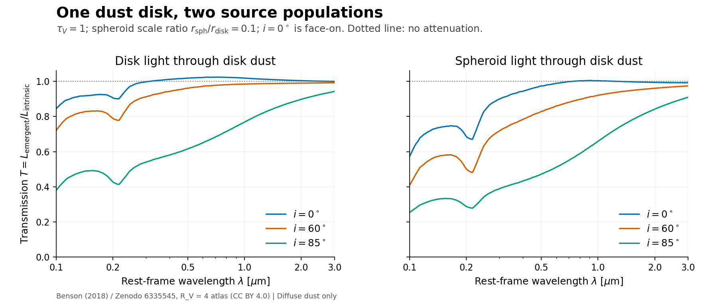
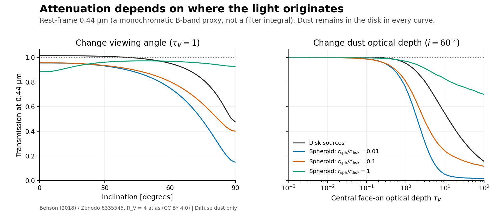
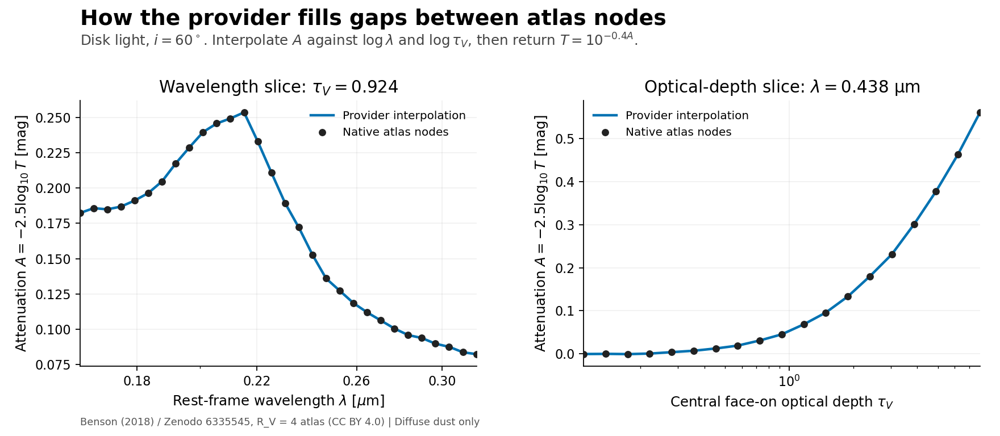

# Benson diffuse-transfer provider

`Benson2018DiffuseProvider` is the first standalone component of
[issue #49](https://github.com/roman-grs-pit/galacticus_sed_calculator/issues/49).
It returns diffuse transmission for disk and spheroid sources through
disk-distributed dust. It can be used with continuum or nebular light when
their source geometry matches. It does not yet connect to `SEDCalculator`,
add a `clouds_diffuse` YAML option, or implement birth clouds or a
galaxy-to-optical-depth conversion.

## Visual guide

These figures use the checksum-verified canonical atlas and the public provider
API. They show **diffuse transmission**, not complete galaxy SEDs: there are no
birth clouds, local nebular attenuation, dust re-emission, or galaxy-population
weights. Wavelengths are rest-frame, not observed-frame Roman wavelengths.

### Same dust, different light sources and viewing angles



At fixed central optical depth, the source distribution and inclination change
the emerging spectrum. Here the compact spheroid is more attenuated than disk
light; this is not a universal ordering for all spheroid sizes. The small
excursions above unity are retained: transmission is directional, and scattering
can redistribute light into a particular viewing direction. It is not a global
photon-survival fraction restricted to [0, 1].

### Varying optical depth and the source geometry



All curves still have **dust in the disk**. Changing the spheroid scale ratio
changes the distribution of the light sources, not the dust distribution.
Extended spheroid sources behave quite differently from compact ones, including
a different inclination dependence. The right panel approaches unity toward
zero optical depth; its portion below 0.01 uses the explicit low-tau transmission
blend. The wavelength 0.44 µm is a monochromatic illustration, not a synthetic
B-band measurement. Ratios use scale radii, not half-light radii.

### What interpolation actually does



Black points are read directly from the HDF5 transmission dataset and converted
to attenuation. Blue curves are evaluated by the provider. Both horizontal
axes are logarithmic and the vertical axes are attenuation in magnitudes, so
the interpolation is piecewise linear on these plots. The other coordinates
are fixed at native nodes. These are illustrations of the interpolation rule,
not independent radiative-transfer validation or error estimates; small atlas
features and Monte Carlo variation are not smoothed away.

Reproduce all three figures from the repository root, with the package and
`matplotlib` installed (`matplotlib` is included in the `diagnostics` extra):

```bash
PYTHONPATH=. python examples/plot_benson_diffuse.py /path/to/atlas.hdf5 \
    --output-dir docs/figures
```

The script uses Matplotlib's non-interactive backend and needs no galaxy catalog
or SSP templates. The derived plots credit the Benson/Zenodo atlas (CC BY 4.0);
the external atlas itself is not bundled.

## External data

Download the R_V=4 file from [Zenodo record 6335545](https://zenodo.org/records/6335545):

```text
compendium_exp_sech_Hernquist_hd0.137_hz0.137_dustD03Rv4.0_Attenuations.hdf5
SHA-256: 2a04540da7c3748279a9f1656bc891dfcd282249a87e0840a53a898c529ec051
Size: 583657496 bytes (approximately 557 MiB)
```

Any local filename is accepted if the content matches this checksum. The data
are CC BY 4.0; cite [Benson (2018)](https://arxiv.org/abs/1810.01449) and the
Zenodo record. This package neither distributes nor automatically downloads
the atlas. Supply an explicit local path, including a shared read-only HPC
path. Wrong-size, corrupt and other-grain files are rejected.

## Usage

```python
from galacticus_sed_calculator.diffuse_dust import (
    Benson2018DiffuseProvider,
    verify_benson_atlas,
)

atlas = verify_benson_atlas("/path/to/atlas.hdf5")
with Benson2018DiffuseProvider(atlas) as provider:
    result = provider.evaluate(
        [0.15, 0.55, 2.0],       # rest-frame microns
        source="spheroid",     # "disk" or "spheroid"; not AGN
        inclination_degrees=60,
        optical_depth_v=1.0,   # central full face-on disk optical depth
        spheroid_scale_ratio=0.1,
    )
    transmission = result.transmission
    print(result.flags, result.coordinates)
    print(provider.provenance)
```

`spheroid_scale_ratio` is the Hernquist source scale radius divided by the
disk radial scale length, not a half-mass or effective-radius ratio. It is
irrelevant for disk sources and unnecessary for dust-free spheroid queries.
The return array preserves the wavelength input shape (including scalars).
Evaluate each source component separately; equal stellar/nebular geometries
use equal transfer. The result contains no attenuation from local clouds.

The provider accepts physical coordinates rather than a catalog or SFH.
Converting gas-metal mass and size into optical depth, assigning orientation,
and diagnosing omitted spheroid dust belong to a separate galaxy adapter.
Future emulators can return `DiffuseTransferResult` with their own geometry
inputs. The result and backend provenance are the reusable interface; the
specific Benson coordinates do not define all future geometries.

## Numerical choices and boundaries

- Interpolate `A = -2.5 log10(T)` multilinearly in log wavelength, inclination
  in degrees, log positive optical depth, and log spheroid scale ratio, then
  return `T = 10**(-0.4 A)`. No slab or fitted residual is used.
- Negative attenuation and hence `T > 1` are retained. These values can arise
  from directional scattering. Nonpositive/nonfinite selected table values
  raise, rather than being floored before taking logarithms.
- Zero optical depth gives exactly one. Below the first positive node (0.01),
  blend transmission linearly from one to the first positive node. This small
  optically thin interval is the explicit exception to log-axis interpolation.
- Wavelengths must be within the atlas's approximately 0.01–3 micron rest-frame
  domain, even for dust-free requests. A 1e-7 relative endpoint tolerance handles
  the stored 2.99999985646 micron endpoint and is flagged; it does not authorize
  physical extrapolation. Out-of-range requested spectra/filters must be
  handled explicitly by the later SED integration.
- Inclination must be finite and within 0–90 degrees; tau must be nonnegative.
  A required source size must be finite and positive. Input sanitation belongs
  to the later galaxy adapter, not this provider.
- Above the maximum optical depth (approximately 1e4), the default is an error.
  `high_tau_policy="clip"` explicitly holds at the maximum and records both
  original and used depths. `"atlas_extrapolation"` uses the stored coefficients
  as `T = exp(c0 + c1 ln(tau))`, interpolating the coefficients over wavelength,
  inclination and source size. This is the original fit, not an RT calculation
  or a boundary-anchored modification. It may be discontinuous at the join.
  Extrapolation is always flagged; positive interpolated slopes receive an
  additional flag. No claim of reliability at arbitrary depths is made.
- Source scale ratios outside 0.001–100 raise unless
  `scale_ratio_policy="clip"` is explicitly selected. Original and used ratios
  are recorded. Zero/negative sizes remain errors under either policy.

The canonical table has a known coherent feature near tau_V=356.2. Its values
are retained without smoothing or correction. Inclination and size-ratio
coordinates are provisional choices, supported by lightweight checks rather
than an extensive optimization study. The example's held-out checks use
doubled node spacing and noisy table values; they do not measure true
full-grid off-node error or validate the model geometry.

## Lifecycle and memory

Hash once with `verify_benson_atlas` before launching workers; pass its picklable
receipt to each worker and open one provider per worker. Workers recheck the
file identity/size/modification time without rehashing it. Keep the file
immutable throughout the run. A provider contains an open HDF5 handle and
cannot be pickled; using a handle inherited across a fork raises. Close
providers with the context manager above.

Only coordinate axes and small query hyperslabs are loaded. For a full
spheroid spectrum a selected block has at most `250 * 2 * 2 * 2` doubles
(16,000 bytes), rather than the full approximately 268 MiB spheroid tensor.
HDF5/NumPy bookkeeping and process imports use additional memory. Uncertainty
arrays are schema-checked but not loaded or propagated. Extrapolation
coefficient blocks are likewise read only when needed.

## Verification and runnable example

From the repository root, with the package installed (or `PYTHONPATH=.`):

```bash
python examples/example_benson_diffuse.py /path/to/atlas.hdf5 \
    --benchmark 100 --check-interpolation

python -m pytest -q tests/test_diffuse_dust.py

BENSON2018_ATLAS=/path/to/atlas.hdf5 \
    python -m pytest -q tests/test_diffuse_dust.py
```

The example prints transmissions, diagnostics, resource provenance, timing,
process peak memory, and optional small held-out inclination/size checks.
Ordinary tests use an analytic synthetic atlas and require no downloads.
The optional canonical test checks the fingerprint, known disk/spheroid
anchors and extreme coordinates against the actual external resource.

### Initial check on the canonical atlas (2026-10-09)

On the development Mac, using Python 3.12, NumPy 2.3.5 and h5py 3.16.0,
100 queries per source with 369 wavelengths took approximately 0.38 ms/query
for disks and 0.97 ms/query for spheroids. Checksum verification took 0.22 s
with the file already in the OS cache. Peak process RSS, including imports
and the checks, was 59 MiB. These are single-process observations, not portable
performance guarantees or timings for the complete SED/catalog pipeline.

The example's small omitted-node checks gave:

| Axis/source | Cells | p95 absolute attenuation residual | Maximum |
| --- | ---: | ---: | ---: |
| Inclination, disk | 45 | 0.0305 mag | 0.0537 mag |
| Inclination, spheroid | 180 | 0.0122 mag | 0.0601 mag |
| Log scale ratio, spheroid | 135 | 0.0224 mag | 0.0865 mag |

These unweighted raw residuals include Monte Carlo variation, deliberately
stress edge-on/compact cases, and omit nodes to double native spacing. They
are not a population-weighted accuracy estimate or an error bound on full-grid
interpolation. The coordinate choices remain provisional as agreed; this
initial provider retains all native nodes without an optimization campaign.
