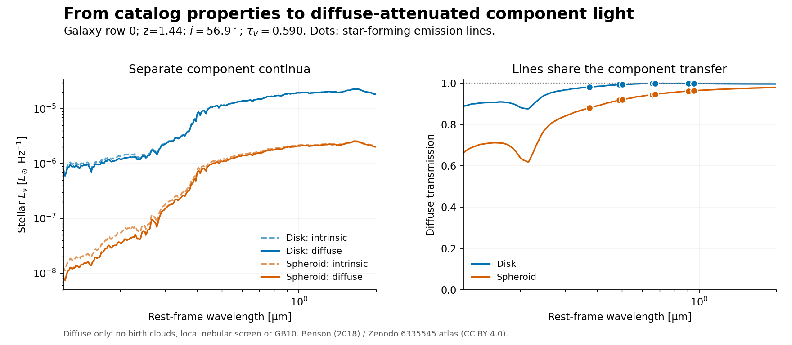

# From galaxy properties to diffuse-attenuated light

This is the second implementation step of [issue #49](https://github.com/roman-grs-pit/galacticus_sed_calculator/issues/49).
It connects the [Benson provider](BENSON_DIFFUSE.md) to Galacticus galaxy
properties and a new, explicit **diffuse-only rest-frame SED API**. It does not
yet implement the complete `clouds_diffuse` model or change the existing
spectrum, photometry, YAML, or saved-catalog workflows.



This example is row 0 of the repository's `data/romanUNIT.hdf5`, using its
stored orientation and the reference dust parameters. Dashed curves are
intrinsic continua; solid curves include diffuse attenuation. The right panel
shows stellar transmission and the identical transfer evaluated at the
emission-line centers (dots). Line luminosities are retained separately, not
added to the continuum plot. Local stellar/nebular attenuation is absent.
These are rest-frame luminosities, not observed-frame Roman fluxes.

## API example

```python
import numpy as np
from galacticus_sed_calculator import SEDCalculator
from galacticus_sed_calculator.diffuse_dust import Benson2018DiffuseProvider, verify_benson_atlas
from galacticus_sed_calculator.galaxy_diffuse import BensonGalaxyDust, DiffuseDustParameters

calculator = SEDCalculator("data/nodePropertyExtractorSED_Nt50_NZ11_ageMinimum0.001.hdf5")
receipt = verify_benson_atlas("/path/to/atlas.hdf5")
with Benson2018DiffuseProvider(receipt) as provider:
    model = BensonGalaxyDust(provider, DiffuseDustParameters(
        dust_to_metals_ratio=0.334,
        cloud_fraction=0.25,
        negative_metal_tolerance_msun=0.0,
    ))
    result = calculator.calculate_diffuse_galaxy_seds(
        "data/romanUNIT.hdf5", 0, np.geomspace(0.12, 2.0, 369), model,
        include_emission_lines=True,
    )
    disk = result.components["disk"]
    spheroid = result.components["spheroid"]
    disk_stellar_lnu = disk.stellar_lnu           # Lsun / Hz
    disk_line_luminosities = disk.line_luminosity # erg / s, integrated per line
    line_names = disk.input_light.line_names
    line_wavelengths = disk.input_light.line_wavelength_micron
    total_stellar_lnu = result.total_stellar_lnu # exactly disk + spheroid
    print(result.diagnostics, result.provenance)
```

Keep the provider/model open across rows. `BensonGalaxyDust` does not own or
close the provider. Worker lifecycle remains as documented for the provider.
Unitless wavelength inputs to this new API are **microns**; Astropy wavelength
quantities are also accepted. Existing APIs still use their original units.

Only line centers within the minimum/maximum requested rest wavelength are
included, irrespective of the sampling density of the continuum grid. Returned
lines are not broadened. Requested wavelengths must lie in both the SED
template and diffuse-provider domains. A template extending beyond 3 µm is
allowed: intrinsic light is resampled to requested wavelengths first, then
attenuated there. No out-of-domain dust transmission is invented.

Both lightcone and fixed-time layouts use the existing SFH compatibility and
age-alignment checks. AGN are deliberately not included. The call does not
implicitly select GB10, fixed-Av, birth clouds, or a local nebular screen.
Consequently it must not be presented as the final calibrated physical model.

## Physical mapping and radius audit

The reference mapping is

```text
M_dust,diffuse = (1 - cloud_fraction) * dust_to_metals_ratio * M_Z,gas,disk
tau_V,0       = opacity_V * M_dust,diffuse / (2*pi*R_disk**2)
source ratio  = R_spheroid / R_disk
```

The provider supplies `opacity_V = 32062.2129019 cm²/g` of dust. The adapter
converts Msun to grams and Mpc to cm explicitly. It never divides by gas mass
or substitutes gas metallicity for gas-metal mass. The cloud fraction removes
material from the diffuse reservoir; it does **not** apply cloud attenuation
to the light in this PR. Setting it to one removes all diffuse attenuation.

The Galacticus source declarations in
`source/objects.nodes.components.disk.standard.F90` and
`source/objects.nodes.components.spheroid.standard.F90` label `radius` as the
disk radial scale length and spheroid scale length, respectively; distinct
`halfMassRadius` properties exist. The bundled and calibrated Roman catalogs
carry matching comments and declare `exponentialDisk`/`hernquist` profiles in
`Parameters/componentDisk` and `Parameters/componentSpheroid`. Therefore **no
1.678 or (1+sqrt(2)) half-mass-radius conversion is applied**.

`read_diffuse_galaxy_inputs(node_data, index)` reads standard field names
`diskAbundancesGasMetals`, `spheroidAbundancesGasMetals`, `diskRadius` and
`spheroidRadius`. It honors their `unitsInSI` metadata, including the slightly
different solar-mass constant used by older Galacticus outputs. Missing unit
metadata raises instead of guessing. Line luminosities similarly use their
`unitsInSI` conversion to erg/s. Stellar Lnu retains the existing SED-kernel
normalization.

Known incompatible profile declarations are rejected when relevant. Where
profile declarations are absent, the explicitly selected Benson adapter assumes
the standard exponential/Hernquist scale-radius convention; it cannot infer
the meaning of custom catalog radii. Direct `DiffuseGalaxyInputs` callers must
supply those scale radii, not projected or half-mass sizes. The original input
values and supplied catalog units/profile declarations are retained in diagnostics.

## Orientation, coverage and input errors

- Use `cos(i) = randomUniform[index, 1]`. Endpoints 0 and 1 give edge-on and
  face-on, respectively. Column 0 stays reserved for GB10 scatter; column 2
  stays reserved for position angle. No new random number is generated.
- An explicit `inclination_degrees` override takes precedence and does not
  require the random-number dataset. Otherwise orientation is required even
  for a dust-free galaxy, so diagnostics remain deterministic and complete.
- Spheroid gas metals are **not** put into the disk. Their mass and fraction of
  total gas metals are recorded, and any positive amount sets a coverage flag.
  This flag is not a threshold declaring the approximation scientifically safe.
- No disk dust means unity diffuse transfer, even with substantial spheroid
  metals. A nonzero diffuse dust mass requires a valid positive disk radius,
  whether or not disk light is present.
- A missing/zero spheroid radius is acceptable only when there is no requested
  spheroid light or no disk dust. A line-only spheroid still needs a radius.
  An absent source returns zero light with identity transmission as a sentinel;
  its coordinates explicitly record `source_has_light=False`.
- Negative/nonfinite light, nonfinite masses, and relevant invalid radii raise.
  Metal masses are strictly nonnegative by default. An explicitly configured
  absolute `negative_metal_tolerance_msun` permits only values within that bound
  to be replaced by zero, recording both the original value and a flag.
  There is no automatic tolerance scaled to the galaxy's mass.
- Atlas-domain policies and flags propagate unchanged. The per-component
  coordinates retain both original and clipped provider inputs; global
  diagnostics retain the physical, unclipped tau and source ratio.

The schema-v1 integer `diagnostics["status"]` is a bitwise OR of:

| Bit value | Meaning |
| ---: | --- |
| 1 | Ignored positive spheroid gas-metal mass |
| 2 | Disk metal mass sanitized within the explicit tolerance |
| 4 | Spheroid metal mass sanitized within the explicit tolerance |
| 8 | Low-optical-depth transmission blend |
| 16 | Optical depth clipped |
| 32 | Optical depth extrapolated |
| 64 | Source scale ratio clipped |
| 128 | Wavelength endpoint roundoff |
| 256 | Positive slope in the atlas extrapolation fit |

String flag names are also returned; invalid galaxies raise and do not receive
a fabricated successful result. Original irrelevant radii may be missing or
nonfinite, so consumers serializing the raw-input diagnostics must preserve
those explicitly rather than assume every original field is finite.

## Composition and follow-up work

The lower-level `model.apply(wavelength_micron, inputs, components)` accepts
`ComponentLight` for disk and/or spheroid. It applies diffuse transfer once to
the supplied stellar and nebular light, which may already have passed through
local attenuation. It leaves those input arrays untouched. This is the hook
for future birth-cloud and local-nebular prescriptions; it does not silently
reinterpret empirical total line attenuation as a local effect.

Kernel generation, cloud-metallicity/optical-properties prescriptions, explicit
GB10 combination modes, observed-frame spectra/photometry, YAML configuration,
saved-catalog metadata and batched catalog processing remain follow-up work.
The initial HDF5 hyperslab provider is unchanged. The agreed in-memory/shared
memory and wavelength-contiguous layout comparisons remain necessary before
selecting the production catalog execution strategy.

## Reproduction and smoke test

With the package and optional Matplotlib installed, from the repository root:

```bash
PYTHONPATH=. python examples/example_diffuse_galaxy.py /path/to/atlas.hdf5 \
    --output-dir /tmp/diffuse-galaxy-example --sample-size 5

# Use --catalog and --template for another compatible lightcone/fixed-time pair.
# --sample-size N evaluates evenly spaced rows and records every rejected row.
BENSON2018_ATLAS=/path/to/atlas.hdf5 python -m pytest -q
```

The example writes a figure plus a JSON diagnostic report. With strict defaults,
the five bundled rows all succeed. A development smoke test on 256 evenly
spaced rows from the 96,424-row
`GP-MCMC-Calibration1_allUNIT_16sqDegMock_XMM-LSS` catalog gave **198 successes
and 58 rejections**, all rejections due to negative gas-metal masses. Of the
successes, 171 flagged ignored spheroid metals and three used the low-tau
blend; none needed extrapolation or clipping. This is an unweighted sample,
not a population completeness or accuracy estimate.

On the development Mac (Python 3.12), those 256 attempts at 369 wavelengths
plus lines took 1.84 seconds (7.2 ms/attempt), excluding template/provider
initialization and plotting. Peak process RSS before plotting was 173 MiB,
including imports and the SED kernel. Rejected rows contribute to that timing;
it is not a benchmark of successful full SED production or multiprocessing.

A separate read-only scan of all rows found 3,041 negative disk and 17,159
negative spheroid gas-metal entries, including both tiny residuals and very
large nonphysical values. This adapter does not repair the catalog or diagnose
the upstream Galacticus cause. Production treatment needs a deliberate input
quality policy, not an indiscriminate zeroing of all negative masses.
